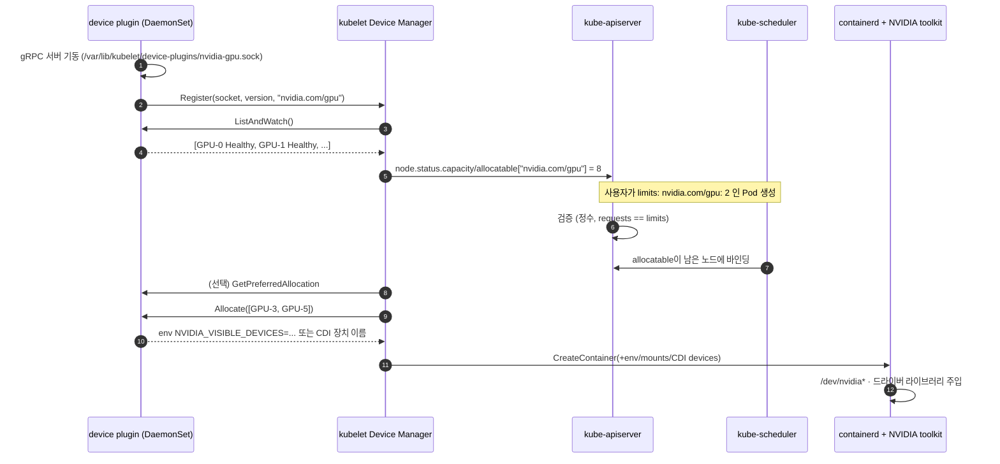
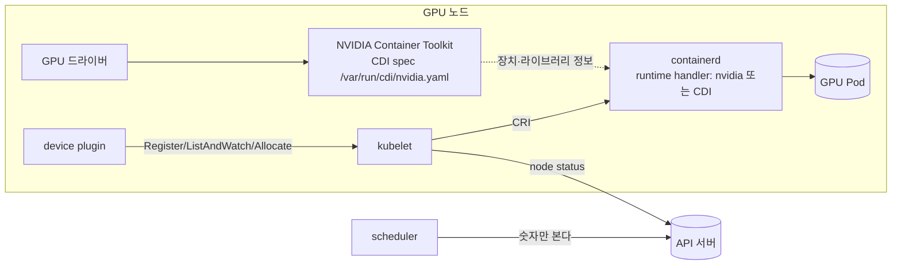

# 01. GPU를 Pod에 붙이는 원리

> [목차로](CURRICULUM.md) · 작성 2026-10-10 · 기준 버전: Kubernetes 1.37 문서, NVIDIA k8s-device-plugin v0.20.1, NVIDIA Container Toolkit v1.20.1
> **[근거]** 출처에 그대로 있는 내용, **[추론]** 여러 출처를 엮어 내린 결론.

## 1. 개념

Kubernetes는 GPU가 무엇인지 모른다. 스케줄러가 아는 것은 노드 status에 적힌 "`nvidia.com/gpu`가 8개 있다"는 숫자뿐이고, 컨테이너 안에 GPU 장치 파일과 드라이버 라이브러리를 넣는 일은 노드 쪽 부품들이 나눠서 한다.

GPU Pod 하나가 뜨기까지 손이 닿는 부품은 넷이다.

| 부품 | 하는 일 | 누가 만드나 |
|------|---------|-------------|
| GPU 드라이버 | 커널 모듈과 `libcuda.so`·`libnvidia-ml.so` 같은 사용자 공간 라이브러리 | NVIDIA (호스트에 설치하거나 GPU Operator 드라이버 컨테이너) |
| device plugin | GPU 개수를 kubelet에 알리고, 배정할 때 어떤 GPU를 줄지 알려 준다 | NVIDIA `k8s-device-plugin` (DaemonSet) |
| kubelet Device Manager | 플러그인 등록을 받고, 노드 status를 갱신하고, 컨테이너 생성 때 플러그인에 `Allocate`를 부른다 | Kubernetes |
| 컨테이너 런타임 + NVIDIA Container Toolkit | 실제로 장치 노드(`/dev/nvidia*`)와 라이브러리를 컨테이너에 넣는다 | containerd/CRI-O + NVIDIA |

### 1.1 device plugin API

- **[근거]** kubelet은 `Registration` gRPC 서비스를 열어 두고, 플러그인은 소켓 이름, 빌드한 API 버전, 광고할 `ResourceName`을 보내 등록한다. `ResourceName`은 `vendor-domain/resourcetype` 형식이고 NVIDIA GPU는 `nvidia.com/gpu`다.
- **[근거]** 플러그인은 `/var/lib/kubelet/device-plugins/` 아래에 자기 Unix 소켓을 열고 다음 RPC를 구현한다. 이 경로는 하드코딩이라 kubelet `--root-dir`의 영향을 받지 않는다.
  - `GetDevicePluginOptions`: 선택 기능(아래 둘) 지원 여부. kubelet은 선택 RPC를 부르기 전에 항상 이걸 먼저 부른다.
  - `ListAndWatch`: 장치 목록을 스트림으로 보낸다. 장치 상태가 바뀌거나 사라지면 새 목록을 다시 보낸다.
  - `Allocate`: 컨테이너 생성 중에 불린다. 응답으로 컨테이너에 더할 환경변수, 장치 노드, 마운트, 어노테이션, CDI 장치 이름을 돌려준다.
  - `GetPreferredAllocation`(선택): 여러 장치 중 무엇을 고르면 좋을지 힌트. 보장은 아니다.
  - `PreStartContainer`(선택): 컨테이너 시작 직전 장치 리셋 같은 작업.
- **[근거]** 순서가 중요하다. 플러그인은 gRPC 서비스를 먼저 띄우고 그다음 `kubelet.sock`으로 등록해야 한다.
- **[근거]** 새 kubelet은 시작할 때 `/var/lib/kubelet/device-plugins` 아래 소켓을 전부 지운다. 플러그인은 자기 소켓이 지워진 것을 감지해 다시 등록해야 한다.
- **[근거]** 장치가 unhealthy가 되면 kubelet은 그 리소스의 **allocatable만 줄이고 capacity는 그대로 둔다.** 이미 그 장치를 받은 Pod는 계속 그 장치에 묶여 있다.
- **[근거]** 1.36부터 기능 게이트 `ResourceHealthStatus`가 베타·기본 켜짐이라, Pod `.status`의 컨테이너 상태에 `allocatedResourcesStatus`가 붙어 배정받은 장치의 건강 상태를 보여 준다.
- **[근거]** CDI 장치 이름을 Device Manager가 처리하는 `DevicePluginCDIDevices`는 1.28 알파, 1.29 베타, 1.31 GA다.

출처: <https://kubernetes.io/docs/concepts/extend-kubernetes/compute-storage-net/device-plugins/> (2026-10-10 확인)

### 1.2 `nvidia.com/gpu`의 요청·제한 규칙

**[근거]** Kubernetes 문서의 규칙:

- GPU는 `limits`에 쓴다. `limits`만 쓰면 `requests`는 같은 값으로 채워진다.
- 둘 다 쓰려면 값이 같아야 한다.
- `limits` 없이 `requests`만 쓸 수 없다.
- 확장 리소스는 정수만 되고 오버커밋이 없다. 장치는 컨테이너끼리 나눠 쓰지 않는다.

출처: <https://kubernetes.io/docs/tasks/manage-gpus/scheduling-gpus/>, <https://kubernetes.io/docs/concepts/extend-kubernetes/compute-storage-net/device-plugins/> (2026-10-10 확인)

**[근거]** 이 규칙은 API 서버 검증에서 걸린다. `pkg/apis/core/validation/validation.go`의 해당 분기에서 나오는 오류 문구는 다음 둘이다(2026-10-10 master 확인).

- 값이 다를 때: `must be equal to nvidia.com/gpu limit of 2`
- `limits`가 없을 때: `Limit must be set for non overcommitable resources`

**[추론]** "GPU 0.5개"나 "두 컨테이너가 GPU 하나를 같이"는 이 모델로 표현할 수 없다. 그래서 나눠 쓰기는 플러그인이 GPU 하나를 여러 개로 **부풀려 광고**하는 방식(time-slicing·MPS)이나 하드웨어를 실제로 쪼개 광고하는 방식(MIG)으로 풀고, 더 세밀한 요구는 DRA로 넘어간다. 04절·05절에서 다룬다.

### 1.3 NVIDIA Container Toolkit과 CDI

device plugin은 "이 컨테이너에 GPU 2번과 5번"이라고 **알려 줄 뿐**, 장치를 직접 넣지 않는다. 넣는 일은 런타임 쪽이다.

- **[근거]** NVIDIA device plugin의 `DEVICE_LIST_STRATEGY`는 `envvar`(기본) · `volume-mounts` · `cdi-annotations` · `cdi-cri` 중 하나 이상이다. `envvar`는 `NVIDIA_VISIBLE_DEVICES` 환경변수로 NVIDIA Container Runtime에 장치를 알린다. `cdi-annotations`는 NVIDIA Container Runtime 없이 CDI를 아는 런타임만 있으면 되고, `cdi-cri`는 CRI의 `CDIDevices` 필드로 넘긴다. 출처: <https://github.com/NVIDIA/k8s-device-plugin> README (2026-10-10 확인)
- **[근거]** CDI(Container Device Interface)는 "장치를 컨테이너에 넣는다는 것"을 런타임 공통 명세로 정한 것이다. NVIDIA Container Toolkit은 v1.12.0부터 CDI 명세를 만들고, v1.18.0부터는 systemd `nvidia-cdi-refresh` 서비스가 `/var/run/cdi/nvidia.yaml`을 자동 생성·갱신한다(툴킷·드라이버 설치·업그레이드, 재부팅 때). 단 **드라이버 제거와 MIG 재구성은 자동으로 못 따라가서** 수동 재생성이 필요하다. 출처: <https://docs.nvidia.com/datacenter/cloud-native/container-toolkit/latest/cdi-support.html> (2026-10-10 확인)
- **[근거]** containerd 설정은 `sudo nvidia-ctk runtime configure --runtime=containerd`로 한다. 기본 동작은 `/etc/containerd/conf.d/99-nvidia.toml` 드롭인을 만들고 `/etc/containerd/config.toml`의 `imports`를 맞춰 주는 것이다. 그 뒤 containerd를 재시작한다. 출처: <https://docs.nvidia.com/datacenter/cloud-native/container-toolkit/latest/install-guide.html> (2026-10-10 확인)
- **[근거]** systemd cgroup 드라이버를 쓰는 시스템에서 `systemctl daemon-reload`를 하면 컨테이너가 GPU 접근을 잃는 알려진 문제가 있다(`Failed to initialize NVML: Unknown Error`). 같은 출처의 troubleshooting 문서.

containerd·cgroup 자체는 이 리포의 [`../containerd/`](../containerd/), [`../cgroup_namespace/`](../cgroup_namespace/), [`../k8s-worker-components.md`](../k8s-worker-components.md)를 본다.

### 1.4 `RuntimeClass`

- **[근거]** `RuntimeClass`(`node.k8s.io/v1`, 1.20 GA)는 CRI 설정 중 하나를 `handler` 이름으로 고르게 한다. Pod에 `runtimeClassName`을 쓰고, 그 RuntimeClass가 없거나 CRI가 그 handler를 못 돌리면 Pod는 `Failed`로 끝난다. 출처: <https://kubernetes.io/docs/concepts/containers/runtime-class/> (2026-10-10 확인)
- **[근거]** NVIDIA device plugin README: `nvidia` 런타임을 기본 런타임으로 두지 않으면(`--set-as-default` 생략) `handler: nvidia`인 RuntimeClass를 정의해야 한다. Helm 차트에도 `runtimeClassName` 값이 있다(보통 `nvidia`).
- **[추론]** 기본 런타임을 `nvidia`로 바꾸면 모든 Pod가 NVIDIA 런타임을 거친다. RuntimeClass로 나누면 GPU를 쓰는 Pod만 거치지만, 이번에는 **device plugin DaemonSet 자신과 GPU Pod 양쪽에** `runtimeClassName`을 빠뜨리지 않아야 한다. 어느 쪽이 맞는지는 클러스터 정책 문제이고, GPU Operator가 이걸 어떻게 처리하는지는 02절에서 본다.

## 2. 그림





## 3. 실습

### 3.1 GPU 노드가 있을 때

```bash
# 1) 노드에 광고된 GPU 수
kubectl get nodes -o custom-columns='NAME:.metadata.name,GPU:.status.allocatable.nvidia\.com/gpu'

# 2) device plugin DaemonSet (정적 매니페스트는 시연용. 운영은 Helm 또는 GPU Operator)
#    README의 정적 매니페스트 예시는 v0.17.1을 가리키지만 최신 릴리스는 v0.20.1(2026-09-22)이다.
helm repo add nvdp https://nvidia.github.io/k8s-device-plugin && helm repo update
helm upgrade -i nvdp nvdp/nvidia-device-plugin -n nvidia-device-plugin --create-namespace \
  --version 0.20.1   # 기본 런타임을 nvidia로 안 바꿨다면: --set runtimeClassName=nvidia
```

`runtimeclass-nvidia.yaml` (기본 런타임을 `nvidia`로 두지 않은 경우만):

```yaml
apiVersion: node.k8s.io/v1
kind: RuntimeClass
metadata:
  name: nvidia
handler: nvidia
```

`gpu-pod.yaml` (NVIDIA README 예시 그대로):

```yaml
apiVersion: v1
kind: Pod
metadata:
  name: gpu-pod
spec:
  restartPolicy: Never
  # runtimeClassName: nvidia   # RuntimeClass 방식일 때
  containers:
    - name: cuda-container
      image: nvcr.io/nvidia/k8s/cuda-sample:vectoradd-cuda12.5.0
      resources:
        limits:
          nvidia.com/gpu: 1
  tolerations:
    - key: nvidia.com/gpu
      operator: Exists
      effect: NoSchedule
```

```bash
kubectl apply -f gpu-pod.yaml
kubectl logs gpu-pod
# 기대 출력 (README):
# [Vector addition of 50000 elements]
# ...
# Test PASSED
# Done

# 컨테이너 안에서 보이는 GPU가 정말 1장인지
kubectl run smi --rm -it --restart=Never --image=nvcr.io/nvidia/cuda:12.5.0-base-ubuntu22.04 \
  --overrides='{"spec":{"containers":[{"name":"smi","image":"nvcr.io/nvidia/cuda:12.5.0-base-ubuntu22.04","command":["nvidia-smi","-L"],"resources":{"limits":{"nvidia.com/gpu":"1"}}}]}}'

# 노드 쪽 확인
nvidia-ctk cdi list                       # CDI 장치 목록
ls /var/lib/kubelet/device-plugins/       # kubelet.sock, nvidia-gpu.sock 등
```

### 3.2 GPU 없이 확인하는 법

GPU가 없어도 **스케줄링과 API 검증**까지는 똑같이 재현된다. 컨테이너가 실제로 GPU를 쓰는 부분만 빠진다.

```bash
# 1) kind 클러스터 (워커 1개)
cat > kind-gpu.yaml <<'EOF'
kind: Cluster
apiVersion: kind.x-k8s.io/v1alpha4
nodes:
  - role: control-plane
  - role: worker
EOF
kind create cluster --name gpu-lab --config kind-gpu.yaml
NODE=gpu-lab-worker

# 2) 가짜 GPU 4장 광고 (공식 문서 "Advertise Extended Resources for a Node" 방식)
#    ~1 은 JSON-Pointer에서 '/'를 뜻한다.
kubectl proxy &
curl -s --header "Content-Type: application/json-patch+json" --request PATCH \
  --data '[{"op":"add","path":"/status/capacity/nvidia.com~1gpu","value":"4"}]' \
  http://localhost:8001/api/v1/nodes/$NODE/status >/dev/null
kubectl get node $NODE -o jsonpath='{.status.allocatable.nvidia\.com/gpu}{"\n"}'   # 4

# 3) GPU를 요청하되 이미지는 pause (실제 GPU 코드는 안 돈다)
cat > fake-gpu-pod.yaml <<'EOF'
apiVersion: v1
kind: Pod
metadata:
  name: fake-gpu
spec:
  containers:
    - name: c
      image: registry.k8s.io/pause:3.10
      resources:
        limits:
          nvidia.com/gpu: 3
EOF
kubectl apply -f fake-gpu-pod.yaml
kubectl get pod fake-gpu -o wide                       # gpu-lab-worker 에 Running
kubectl describe node $NODE | grep -A8 'Allocated resources'   # nvidia.com/gpu 3 / 4

# 4) 하나 더 (2장) → 남은 건 1장이라 Pending
sed 's/fake-gpu/fake-gpu-2/; s/gpu: 3/gpu: 2/' fake-gpu-pod.yaml | kubectl apply -f -
kubectl describe pod fake-gpu-2 | grep -A3 Events     # Insufficient nvidia.com/gpu

# 5) API 검증만 보기 (만들지 않음)
cat > bad-gpu.yaml <<'EOF'
apiVersion: v1
kind: Pod
metadata:
  name: bad-gpu
spec:
  containers:
    - name: c
      image: registry.k8s.io/pause:3.10
      resources:
        requests:
          nvidia.com/gpu: 1
        limits:
          nvidia.com/gpu: 2
EOF
kubectl apply --dry-run=server -f bad-gpu.yaml
# ... must be equal to nvidia.com/gpu limit of 2
```

- **[근거]** 노드 status에 확장 리소스를 PATCH로 광고하는 방법과 정수만 된다는 점: <https://kubernetes.io/docs/tasks/administer-cluster/extended-resource-node/> (2026-10-10 확인)
- **[근거]** kubelet의 `reconcileExtendedResource`는 Device Manager가 "노드가 다시 만들어졌다"고 판단하면 확장 리소스 capacity·allocatable을 0으로 만든다(`pkg/kubelet/kubelet_node_status.go`, 2026-10-10 master 확인).
- **[추론]** 그래서 kind 노드 컨테이너를 재시작하면 패치한 가짜 GPU가 0으로 돌아갈 수 있다. 실습 중 숫자가 사라지면 2)를 다시 하면 된다.
- **[추론]** 이 방법은 Device Manager를 거치지 않으므로 `Allocate`·`ListAndWatch` 흐름은 재현되지 않는다. 플러그인 흐름까지 보고 싶으면 가짜 장치를 광고하는 device plugin을 직접 띄워야 하는데, 공식 배포물이 아니어서 여기서는 다루지 않는다. DRA 쪽에는 공식 예제 드라이버가 있어 05절에서 쓴다.

## 4. 흔한 실수

1. **GPU를 요청하지 않은 컨테이너가 GPU를 전부 본다.** [근거] NVIDIA README 경고: device plugin을 쓰면서 GPU를 요청하지 않으면 그 컨테이너에 노드의 GPU가 전부 노출된다. [추론] CUDA 베이스 이미지가 `NVIDIA_VISIBLE_DEVICES=all`을 갖고 있고, 기본 런타임이 `nvidia`일 때 이 환경변수가 그대로 해석되기 때문이다. GPU 노드에 아무 Pod나 뜨지 않게 하는 taint는 03절.
2. **`requests`만 쓰거나 `requests` ≠ `limits`.** API 서버에서 바로 거절된다(3.2의 5).
3. **`0.5`나 `500m`를 쓴다.** 확장 리소스는 정수만 된다.
4. **RuntimeClass 방식인데 `runtimeClassName`을 빠뜨린다.** Pod는 뜨지만 기본 런타임(runc)으로 떠서 컨테이너 안에 GPU가 없다. [추론] 스케줄링은 성공하므로 `nvidia-smi: not found`나 CUDA 초기화 실패로만 드러난다.
5. **containerd 설정만 바꾸고 재시작하지 않는다.** `nvidia-ctk runtime configure` 뒤에는 containerd 재시작이 필요하다.
6. **MIG 구성을 바꾸고 CDI 명세를 그대로 둔다.** `nvidia-cdi-refresh`는 MIG 재구성을 못 따라간다. `nvidia-ctk cdi generate`로 다시 만든다.
7. **`systemctl daemon-reload` 뒤 GPU가 갑자기 사라진다.** systemd cgroup 드라이버의 알려진 문제. 툴킷 troubleshooting 문서부터 본다.
8. **고장 난 GPU를 capacity로 센다.** unhealthy가 되면 allocatable만 줄어든다. 가용량은 항상 `allocatable`로 본다.

## 5. 확인 문제

1. 노드에 `nvidia.com/gpu` capacity 8, allocatable 7이 보인다. GPU를 쓰는 Pod는 하나도 없다. 무슨 일이 일어났을 가능성이 크고, 그 GPU를 쓰던 Pod가 있었다면 어떻게 되나?
2. `limits: {nvidia.com/gpu: 1}`만 쓴 Pod와 `requests: {nvidia.com/gpu: 1}`만 쓴 Pod를 각각 `--dry-run=server`로 넣으면 어떻게 되나?
3. device plugin은 정상 등록됐고 스케줄링도 됐는데 컨테이너 안에서 `nvidia-smi`가 GPU를 못 찾는다. 1절 부품 표에서 의심할 칸 두 개는?

<details>
<summary>답</summary>

1. 장치 하나가 unhealthy로 보고됐다. kubelet은 allocatable만 줄이고 capacity는 그대로 둔다. 그 장치를 이미 받은 Pod는 계속 그 장치에 묶여 있고, 코드가 실패하면 restartPolicy에 따라 Failed가 되거나 크래시 루프에 빠진다. 1.36 이상이면 `allocatedResourcesStatus`로 확인할 수 있다.
2. 앞의 것은 통과한다(requests가 1로 채워진다). 뒤의 것은 `Limit must be set for non overcommitable resources`로 거절된다.
3. 컨테이너 런타임과 NVIDIA Container Toolkit 칸(RuntimeClass 누락, containerd 미재시작, CDI 명세 낡음), 그리고 드라이버 칸(호스트 드라이버 미설치·버전 불일치). device plugin은 "알려 주기"만 하므로 여기까지 왔으면 범인일 가능성이 낮다.

</details>

## 6. 출처 (모두 2026-10-10 확인)

- Kubernetes, Schedule GPUs: <https://kubernetes.io/docs/tasks/manage-gpus/scheduling-gpus/>
- Kubernetes, Device Plugins: <https://kubernetes.io/docs/concepts/extend-kubernetes/compute-storage-net/device-plugins/>
- Kubernetes, Advertise Extended Resources for a Node: <https://kubernetes.io/docs/tasks/administer-cluster/extended-resource-node/>
- Kubernetes, Runtime Class: <https://kubernetes.io/docs/concepts/containers/runtime-class/>
- Kubernetes 소스, 리소스 검증: <https://github.com/kubernetes/kubernetes/blob/master/pkg/apis/core/validation/validation.go>
- Kubernetes 소스, 확장 리소스 0 처리: <https://github.com/kubernetes/kubernetes/blob/master/pkg/kubelet/kubelet_node_status.go>
- NVIDIA k8s-device-plugin README·릴리스(v0.20.1, 2026-09-22): <https://github.com/NVIDIA/k8s-device-plugin>
- NVIDIA Container Toolkit 설치(v1.20.1): <https://docs.nvidia.com/datacenter/cloud-native/container-toolkit/latest/install-guide.html>
- NVIDIA Container Toolkit CDI: <https://docs.nvidia.com/datacenter/cloud-native/container-toolkit/latest/cdi-support.html>
